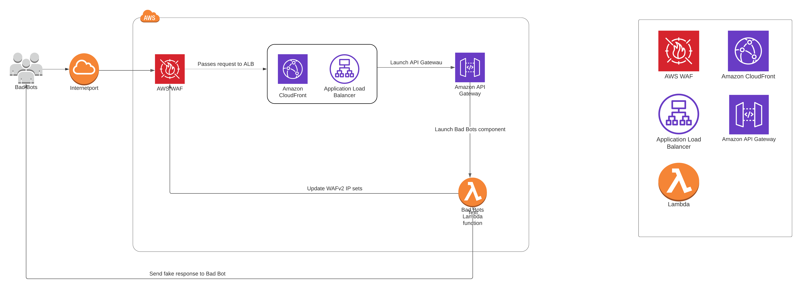
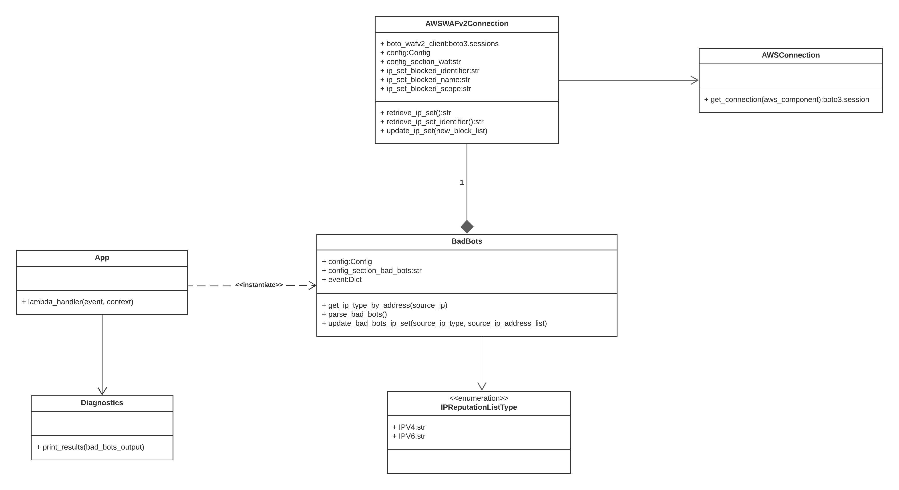
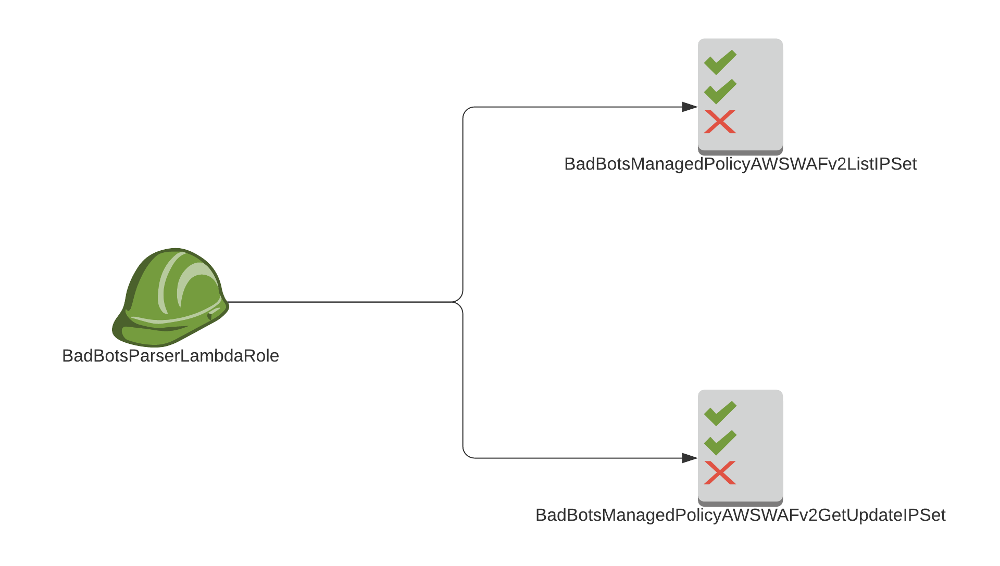

# Bad Bots    
 The purpose of this Lambda function is to lure in Bad Bots using a trap endpoint a.k.a. Honeypot and subsequently blocking the bots making the requests.      
      
This Lambda function is part of the AWS WAF Security Automations project.      
      
See the [AWS docs](https://docs.aws.amazon.com/solutions/latest/aws-waf-security-automations/architecture.html) for reference.      
      
## Table of contents      
* [Diagrams](#diagrams)      
* [AWS Services](#aws-services)      
* [Development](#development)      
* [Issues](#issues)      
* [License](#License)      
* [Deployment pipeline](#) *(Not yet created)*  
  ## Diagrams **AWS Architecture Diagram**     
       
  
- ##### AWS WAF - AWS WAF contains the WAFv2  IP sets which is used as a block list for the IP addresses detected by the Bad Bots Lambda function. 
- ##### API Gateway trap endpoint - This is the API Gateway trap endpoint that will be used to lure in bad bots.
- ##### Bad Bots Lambda - This Lambda function will be triggered by the API Gateway trap endpoint after a 'bad bot' makes a request.        
 - Then it will first determine the IP address type.  
 - Then it will update the respective IP set with the IP address of the bad bot.     
    
**UML Class Diagram**        
     
    
**AWS IAM Diagram**           
    
## AWS Services      
- [Lambda](https://aws.amazon.com/documentation/lambda)    
- [API Gateway](https://docs.aws.amazon.com/apigateway/index.html)        
- [WAFv2](https://docs.aws.amazon.com/waf/latest/APIReference/Welcome.html)      
      
      
## Development   
You will need the following dependencies installed on your system before getting started:      
      
 * AWS SAM CLI - `brew install aws-sam-cli` 
* [Docker](https://www.docker.com/products/docker-desktop)      
 * Python3.8 - `brew install python3.8` * Pytest - `pip3 install pytest`      
      
 Use the Makefile to setup:         
`make install`      
   
 To build the application:         
`sam build`      
   
 To run and test function locally using Docker:         
`sam local invoke`      
   
 To run all tests:         
`python3.8 -m pytest ./tests/ -sv`      
   
 To run `unit` tests only:          
`python3.8 -m pytest ./tests/unit -sv`   
 
 To run `system` tests only:      
`python3.8 -m pytest ./tests/system -sv`   

## Issues 
This project is currently not live in production due to a problem with the Coolblue Linter used in the TeamCity pipelines that rejects the CloudFormation template file '*iam.yaml*'. This template file is responsible for the defining the IAM roles and IAM policies attached to the application.    
    
Currently, the problematic section is:    
  

    BadBotsManagedPolicyAWSWAFv2ListIPSet:  
      Type: "AWS::IAM::ManagedPolicy"  
      Properties:  
        Description: !Sub "Policy for managing WAFv2 IP blocklist ${AppGroup}"  
      PolicyDocument:  
          Version: "2012-10-17"  
      Statement:  
            - Effect: "Allow"  
      Action:  
                - "wafv2:ListIPSets"  
      Resource: "*"

The policy contains the forbidden wildcard `*` used in the resource definition. This is a mandatory line because of the nature of the wafv2:ListIPSets operation. The problem with the Coolblue Linter will need to be resolved first before pushing this towards production.    
    
    
## License [CoolBlue License](./LICENSE.md)